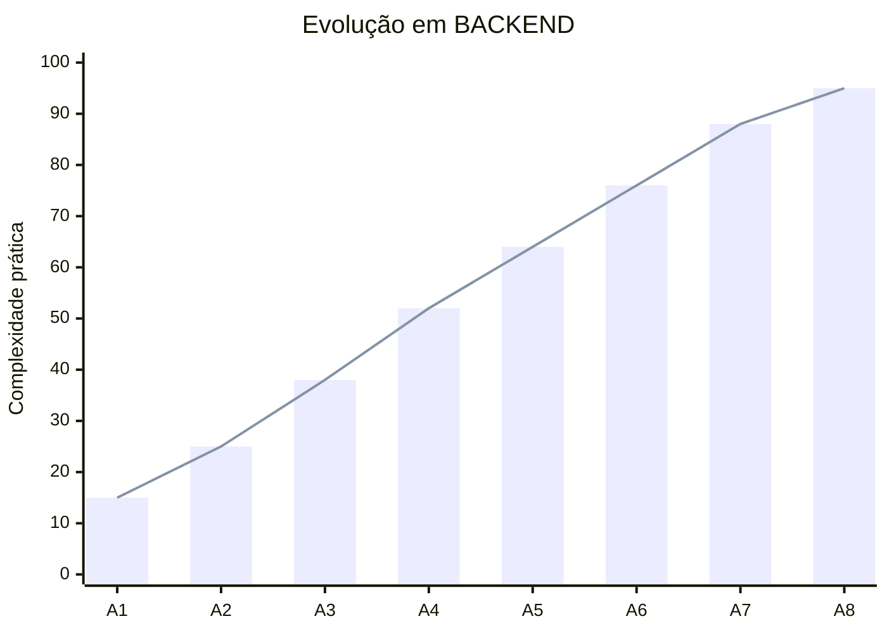
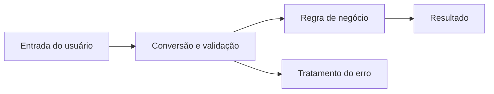

<div align="center">


# BACKEND

### Lógica, regras de negócio e processamento de dados


</div>

[← Voltar ao README principal](../README.md)

---


## Sobre a matéria

BACKEND é a área responsável pelo funcionamento interno de uma aplicação. Ela recebe informações, valida entradas, executa cálculos, aplica regras de negócio e devolve resultados. Neste termo, esses conceitos são praticados com **JavaScript executado no Node.js**, inicialmente por meio de programas no terminal.

A disciplina desenvolve raciocínio lógico e ensina a transformar um problema em uma sequência clara de instruções. Os exercícios avançam de comandos simples para sistemas divididos em funções, com menus, coleções de dados e tratamento de erros.

## Objetivos de aprendizagem

- Compreender variáveis, constantes e tipos de dados;
- Receber e converter entradas fornecidas pelo usuário;
- Utilizar operadores aritméticos, relacionais e lógicos;
- Criar decisões com estruturas condicionais;
- Automatizar tarefas utilizando estruturas de repetição;
- Armazenar e percorrer conjuntos de valores com arrays;
- Dividir problemas em funções reutilizáveis;
- Implementar e validar regras de negócio;
- Identificar e tratar erros sem interromper o programa;
- Organizar aplicações em diferentes arquivos e módulos.

## Tecnologias utilizadas

<div align="center">


</div>

## Evolução das aulas

| Pasta | Foco principal | Conhecimentos praticados |
|---|---|---|
| [A1](./A1) | Introdução ao JavaScript | Saída no console, variáveis, valores e primeiros programas |
| [A2_Celso](./A2_Celso) | Entrada, conversão e cálculos | `readline-sync`, `Number()`, operadores, média e relatórios |
| [A3](./A3) | Estruturas condicionais | Comparações, tomada de decisão e classificação de resultados |
| [A4](./A4) | Repetições e regras | `for`, `while`, contadores, menus, tabuada, crédito e desafios |
| [A5](./A5) | Arrays | Criação de listas, acesso por índice, percursos e processamento de coleções |
| [A6](./A6) | Funções | Parâmetros, retorno, reaproveitamento de lógica e separação de responsabilidades |
| [A7](./A7) | Sistemas aplicados | Organização em arquivos, logística, oficina e cálculo de energia |
| [A8](./A8) | Tratamento de erros | Validação, `throw`, `Error`, `try...catch` e continuidade segura |
| [A_Especial](./A_Especial) | Exploração adicional | Exercícios em JavaScript, HTML e Python |

## Conteúdo por etapa

### A1 — Primeiros programas

A primeira etapa apresenta a estrutura básica de um arquivo JavaScript e a execução pelo Node.js. O foco está em compreender a ordem das instruções, declarar dados e mostrar resultados com `console.log()`.

### A2 — Entrada e processamento

Os programas passam a interagir com o usuário por meio do terminal. A biblioteca `readline-sync` coleta textos e números; em seguida, os valores são convertidos, calculados e apresentados em relatórios. A atividade final organiza dados escolares, notas, faltas e média.

### A3 — Decisões

As atividades introduzem condições que alteram o comportamento do programa. Exemplos como entrada em uma balada e avaliação de notas exercitam comparações e respostas diferentes para cada situação.

### A4 — Repetições e regras de negócio

Nesta etapa, estruturas `for` e `while` evitam repetição manual de código. Contadores, menus e tabuadas mostram como automatizar sequências. A análise de crédito e os desafios acrescentam regras mais completas e combinação de condições.

### A5 — Arrays

Arrays permitem guardar vários valores em uma única estrutura. As atividades trabalham índices, percursos, comparação e processamento de elementos, preparando o código para cadastros e conjuntos de dados maiores.

### A6 — Funções

As funções dividem um programa em operações menores. Cada função pode receber parâmetros, executar uma responsabilidade e retornar um resultado. Isso reduz duplicações e torna o código mais fácil de ler, testar e reutilizar.

### A7 — Aplicações organizadas

Os conhecimentos anteriores são aplicados em contextos de logística, oficina e consumo de energia. Alguns projetos separam a execução principal das funções, aproximando a estrutura dos programas de aplicações profissionais.

### A8 — Validação e exceções

A etapa atual trabalha confiabilidade. Entradas inválidas são detectadas e transformadas em erros controlados. Com `try...catch`, o programa explica o problema ao usuário e pode continuar executando sem encerrar inesperadamente.

## Gráfico de evolução

> O gráfico representa o aumento da complexidade prática dos exercícios, não uma nota escolar.



## Como executar as atividades

É necessário possuir o [Node.js](https://nodejs.org/) instalado.

1. Entre na pasta da atividade desejada;
2. Instale as dependências quando houver um arquivo `package.json`;
3. Execute o arquivo JavaScript com o Node.js.

```bash
cd BACKEND/A8
npm install
node trycat4.js
```

Para outro exercício, substitua `trycat4.js` pelo nome do arquivo desejado.

## Fluxo de um programa de backend



## Estado atual e próximos passos

**Estado atual:** construção de programas interativos com decisões, repetições, arrays, funções, divisão em arquivos e tratamento de erros.

**Próximas evoluções esperadas:**

- Objetos e estruturas de dados mais complexas;
- Modularização com importação e exportação;
- Programação assíncrona;
- Criação de APIs;
- Integração com banco de dados;
- Testes automatizados;
- Autenticação e segurança.

---

<div align="center">

**BACKEND transforma dados e regras em funcionamento.**

[BCD](../Banco%20De%20Dados) • [LIMA](../LIMA) • [Repositório principal](../README.md)

</div>
