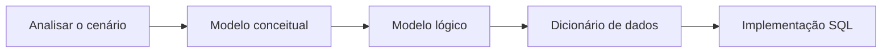
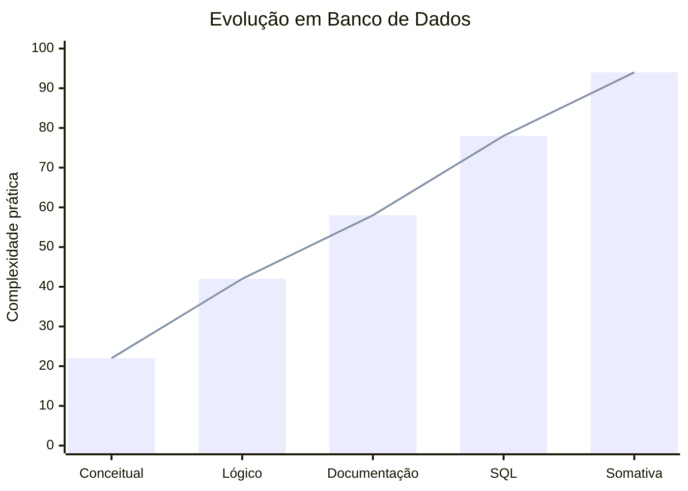

<div align="center">


# BCD — Banco de Dados

### Modelagem, organização e persistência de informações


</div>

[← Voltar ao README principal](../README.md)

---


## Sobre a matéria

**BCD significa Banco de Dados.** A matéria ensina a transformar informações de um problema real em uma estrutura organizada, consistente e consultável. Um banco de dados permite que aplicações mantenham cadastros, históricos e relacionamentos mesmo depois que o programa é encerrado.

O aprendizado parte da análise do cenário, passa pela modelagem conceitual e lógica no **brModelo** e chega à implementação física utilizando **SQL**. Os projetos deste repositório abordam clínica médica, cafeteria e oficina mecânica.

## Objetivos de aprendizagem

- Identificar entidades, atributos e relacionamentos;
- Interpretar regras de negócio antes de construir tabelas;
- Criar modelos conceituais e lógicos;
- Compreender cardinalidades 1:1, 1:N e N:N;
- Definir chaves primárias e estrangeiras;
- Produzir um dicionário de dados;
- Escolher tipos adequados para cada informação;
- Criar e alterar bancos e tabelas com SQL;
- Inserir e consultar registros;
- Aplicar restrições para preservar a integridade dos dados.

## Tecnologias e ferramentas

<div align="center">


</div>

## Evolução das aulas

| Pasta | Foco principal | Materiais e aplicações |
|---|---|---|
| [AULA-01 e 02](./AULA-01%20e%2002) | Modelagem conceitual e lógica | Clínica Médica, Smart Coffee, entidades, atributos e relacionamentos |
| [AULA 3 e 4](./AULA%203%20e%204) | Dicionário de dados e refinamento | Documentação das estruturas da Clínica e Smart Coffee |
| [AULA 5](./AULA%205) | Implementação em SQL | Criação dos bancos, tabelas, restrições, inserções e consultas |
| [Somativas](./Somativas) | Projeto avaliativo | Modelagem e implementação de um banco para oficina mecânica |

## Etapas de construção de um banco



### 1. Análise e modelo conceitual

O problema é estudado antes da implementação. São identificadas as entidades importantes — por exemplo, paciente, médico, veículo ou serviço —, suas características e a forma como se relacionam. O modelo conceitual descreve o domínio sem depender de comandos SQL.

### 2. Modelo lógico

O modelo conceitual é convertido em tabelas. Nessa fase são definidos campos, chaves primárias, possíveis chaves estrangeiras e cardinalidades. Relacionamentos muitos-para-muitos precisam de tabelas associativas.

### 3. Dicionário de dados

O dicionário documenta o significado de cada tabela e campo, o tipo de dado esperado, as restrições e o papel da informação. Essa documentação ajuda a manter consistência entre o planejamento e a implementação.

### 4. Modelo físico em SQL

O planejamento é transformado em comandos executáveis. Os scripts criam bancos, tabelas e registros para os cenários trabalhados.

## Comandos SQL estudados

| Comando | Finalidade |
|---|---|
| `CREATE DATABASE` | Criar um banco de dados |
| `USE` | Selecionar o banco ativo |
| `CREATE TABLE` | Criar uma tabela e seus campos |
| `ALTER TABLE` | Adicionar, modificar ou remover elementos de uma tabela |
| `RENAME TABLE` | Renomear uma tabela |
| `DROP` | Excluir bancos, tabelas ou outras estruturas |
| `TRUNCATE TABLE` | Remover todos os registros mantendo a tabela |
| `INSERT INTO` | Inserir registros |
| `SELECT` | Consultar dados |

## Tipos e restrições praticados

| Recurso | Uso |
|---|---|
| `INT` | Valores inteiros e identificadores |
| `VARCHAR(n)` | Textos com tamanho máximo definido |
| `TEXT` | Textos mais extensos |
| `DATE` | Datas |
| `TIMESTAMP` | Data e horário, inclusive geração automática |
| `DECIMAL(p,s)` | Valores decimais, como preços e doses |
| `ENUM` | Conjunto fechado de opções permitidas |
| `PRIMARY KEY` | Identificação única de cada registro |
| `AUTO_INCREMENT` | Geração automática de identificadores |
| `NOT NULL` | Campo obrigatório |
| `UNIQUE` | Impede valores repetidos |
| `DEFAULT` | Define um valor padrão |

## Projetos desenvolvidos

### Clínica Médica

O projeto representa informações de atendimentos, pacientes, médicos, fichas médicas, funcionários e medicamentos. Ele exercita diferentes tipos de dados, identificadores automáticos, valores únicos, campos obrigatórios, enumerações, datas automáticas, inserções e consultas.

### Smart Coffee

O cenário de cafeteria é utilizado desde a modelagem até a geração do banco, permitindo praticar refinamento de entidades e transformação do diagrama em uma estrutura SQL.

### Oficina Mecânica — Atividade somativa

A avaliação reúne tabelas como serviços, clientes, funcionários, veículos, marcas, modelos, peças, fornecedores, ordens de serviço e pagamentos. O exercício exige interpretar um domínio maior e aplicar operações de criação e alteração de tabelas.

## Gráfico de evolução

> O gráfico representa a complexidade dos artefatos presentes, não uma nota escolar.



## Como utilizar os arquivos

- Arquivos `.brM`: abra no **brModelo** para visualizar e editar os diagramas;
- Arquivos `.rtf`: contêm documentação e dicionários de dados;
- Arquivos `.sql`: execute em um ambiente MySQL compatível, revisando antes comandos destrutivos como `DROP` e `TRUNCATE`;
- `brModelo.exe`: executável incluído nas atividades iniciais para abrir os modelos.

Exemplo de execução de um script pelo terminal:

```bash
mysql -u seu_usuario -p < "Banco De Dados/AULA 5/Criador_Clinica1.0.sql"
```

> Alguns scripts foram construídos como material de estudo e contêm comandos de criação e exclusão na mesma sequência. Execute os trechos necessários de forma controlada.

## Estado atual e próximos passos

**Estado atual:** modelagem conceitual e lógica, documentação e implementação das estruturas fundamentais em SQL.

**Próximas evoluções esperadas:**

- Aplicação completa de chaves estrangeiras;
- Normalização de dados;
- Consultas com filtros, ordenação e agrupamento;
- Relacionamento de tabelas com `JOIN`;
- Índices e análise de desempenho;
- Views, procedures e triggers;
- Transações, permissões, backup e segurança;
- Integração do banco com o backend.

---

<div align="center">

**Um banco bem modelado transforma informação em estrutura confiável.**

[BACKEND](../BACKEND) • [LIMA](../LIMA) • [Repositório principal](../README.md)

</div>
