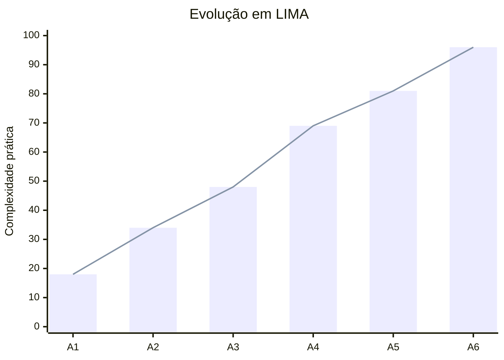
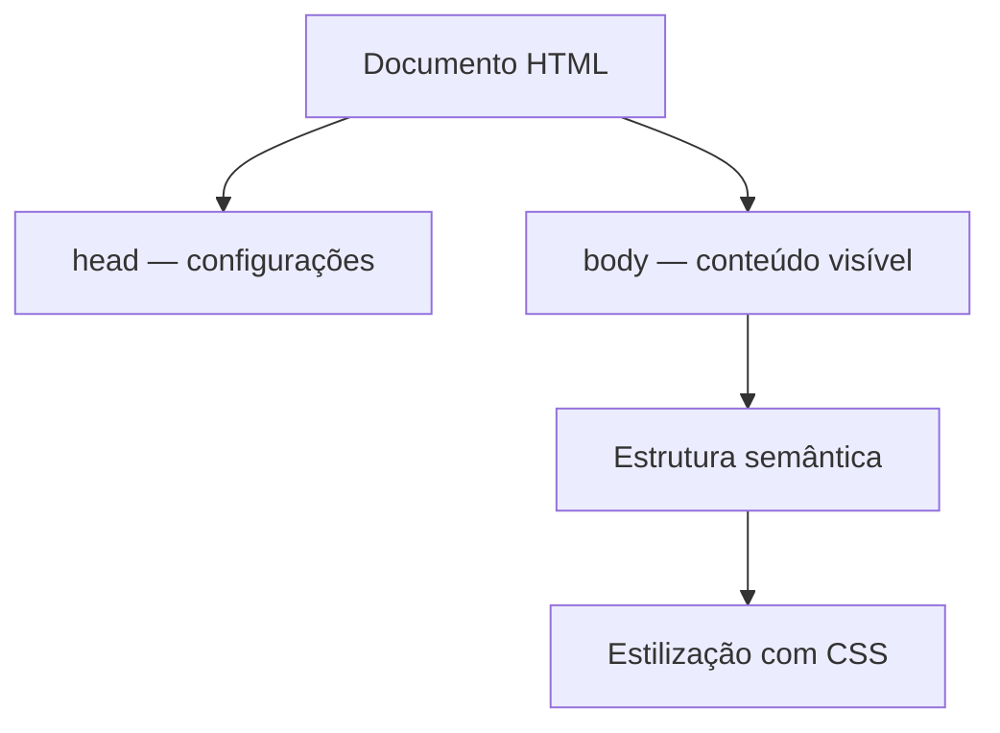

<div align="center">


# LIMA — Linguagem de Marcação

### Estrutura, semântica e apresentação de interfaces web


</div>

[← Voltar ao README principal](../README.md)

---


## Sobre a matéria

**LIMA significa Linguagem de Marcação.** A matéria ensina a estruturar conteúdo digital utilizando HTML e a definir sua aparência por meio do CSS. O HTML descreve o significado de cada parte da página; o CSS controla cores, fontes, espaçamentos, bordas e disposição visual.

HTML não é uma linguagem de programação: ele organiza informações. Quando combinado com CSS, torna possível construir páginas navegáveis e interfaces claras. A progressão deste termo começa com uma página simples e chega a sites semânticos, estilizados e compostos por várias seções.

## Objetivos de aprendizagem

- Compreender a estrutura padrão de um documento HTML;
- Utilizar títulos, parágrafos, listas, links e imagens;
- Criar navegação interna, externa e entre páginas;
- Separar conteúdo, estrutura e apresentação;
- Utilizar elementos semânticos do HTML5;
- Aplicar estilos por seletores, classes e propriedades CSS;
- Entender CSS inline, interno e externo;
- Trabalhar com margens, preenchimentos, bordas e fundos;
- Organizar elementos utilizando Flexbox;
- Produzir uma página institucional completa;
- Preparar interfaces para acessibilidade e responsividade.

## Tecnologias utilizadas

<div align="center">


</div>

## Evolução das aulas

| Pasta | Foco principal | Conhecimentos praticados |
|---|---|---|
| [A1](./A1) | Introdução ao HTML e CSS | Estrutura inicial, títulos, parágrafos, links e primeiros estilos |
| [A2](./A2) | Navegação e múltiplas páginas | Páginas de clientes, equipe, pedidos, produtos e serviços |
| [A3](./A3) | Conteúdo visual | Uso de imagens, caminhos e composição de uma página |
| [A4](./a4) | HTML semântico | Currículo e blog com `header`, `nav`, `main`, `article` e `footer` |
| [A5](./A5) | CSS e listas | Estilos inline, internos, externos, seletores, classes e revisão |
| [A6](./A6) | Projeto somativo | Site institucional DevSolutions com HTML semântico e CSS externo |

## Conteúdo por etapa

### A1 — Estrutura fundamental

As primeiras páginas apresentam `DOCTYPE`, idioma, `head`, metadados, título e `body`. O conteúdo utiliza cabeçalhos, parágrafos, quebras de linha e links. Os primeiros estilos trabalham fonte, fundo, cor, tamanho, borda, sombra e centralização.

### A2 — Navegação entre páginas

O projeto cresce para um conjunto de páginas relacionadas. Clientes, equipe, pedidos, produtos e serviços passam a possuir documentos próprios, conectados por links. Essa estrutura introduz a arquitetura básica de um site.

### A3 — Imagens e recursos

A utilização de imagens locais mostra a diferença entre conteúdo textual e recursos externos. Também são exercitados caminhos de arquivos e o atributo `alt`, importante para descrever uma imagem quando ela não pode ser visualizada e para apoiar acessibilidade.

### A4 — Semântica

A semântica substitui estruturas genéricas por elementos que explicam o papel do conteúdo. O blog de tecnologia utiliza cabeçalho, navegação, conteúdo principal, artigos e rodapé. As páginas de notícias e postagens demonstram a reutilização de uma estrutura coerente.

### A5 — Formas de aplicar CSS

As atividades comparam três formas de estilização:

- **Inline:** estilo escrito diretamente no elemento;
- **Interno:** regras colocadas em uma tag `style` dentro do documento;
- **Externo:** regras mantidas em um arquivo `.css` separado.

O CSS externo facilita a reutilização e a manutenção quando várias páginas compartilham a mesma identidade visual.

### A6 — Projeto somativo DevSolutions

A avaliação final reúne os conteúdos do termo em um site institucional. A página possui cabeçalho, menu, apresentação, informações da empresa, serviços, equipe, projetos, contato e rodapé. O HTML fica separado do arquivo `style.css`, aproximando o projeto da organização adotada em aplicações reais.

## Elementos HTML praticados

| Grupo | Elementos e conceitos |
|---|---|
| Documento | `html`, `head`, `meta`, `title` e `body` |
| Texto | `h1` a `h6`, `p`, `b`, `br` e `hr` |
| Navegação | `a`, caminhos relativos, URLs externas e âncoras |
| Conteúdo | Listas, imagens e textos organizados |
| Semântica | `header`, `nav`, `main`, `section`, `article` e `footer` |
| Identificação | `class` para estilos reutilizáveis e `id` para elementos e âncoras |
| Acessibilidade inicial | Idioma do documento, metadados e texto alternativo em imagens |

## Recursos CSS praticados

| Grupo | Propriedades e conceitos |
|---|---|
| Tipografia | `font-family`, `font-size`, `font-weight`, cor e alinhamento |
| Modelo de caixa | `width`, `margin`, `padding` e `border` |
| Aparência | `background-color`, `border-radius` e `box-shadow` |
| Seletores | Elementos, classes e seletores descendentes |
| Layout | `display: flex`, alinhamento, distribuição e `gap` |
| Imagens | Dimensões, margens, caminhos locais e URLs externas |
| Organização | CSS inline, interno e externo |

## Gráfico de evolução

> O gráfico representa o aumento de complexidade das páginas, não uma nota escolar.



## Anatomia de uma página



## Como visualizar as atividades

Não é necessário instalar dependências para abrir as páginas atuais.

1. Entre na pasta da aula;
2. Localize o arquivo `index.html`;
3. Abra-o em um navegador.

Para desenvolvimento, também é possível utilizar a extensão **Live Server** no Visual Studio Code. No projeto somativo:

```text
LIMA/A6/Somativa/
├── index.html
└── style.css
```

O navegador carrega o HTML, que referencia o CSS por meio de:

```html
<link rel="stylesheet" href="style.css">
```

## Estado atual e próximos passos

**Estado atual:** criação de páginas com HTML5 semântico, navegação, imagens, várias seções e estilização externa com CSS3.

**Próximas evoluções esperadas:**

- Design responsivo com media queries;
- Formulários e validação de campos;
- Acessibilidade seguindo boas práticas;
- Flexbox e CSS Grid em layouts mais complexos;
- Variáveis e organização avançada de CSS;
- Interação com JavaScript;
- Consumo de APIs;
- Integração da interface com backend e banco de dados.

---

<div align="center">

**LIMA transforma conteúdo em uma interface compreensível e visual.**

[BACKEND](../BACKEND) • [BCD](../Banco%20De%20Dados) • [Repositório principal](../README.md)

</div>
