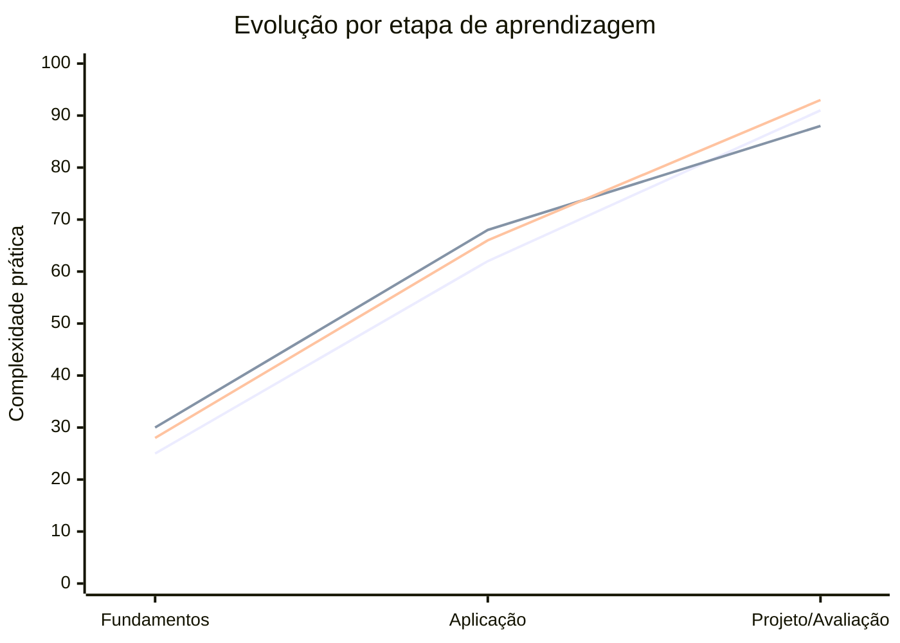
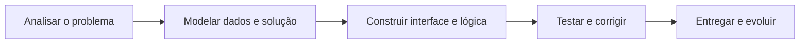
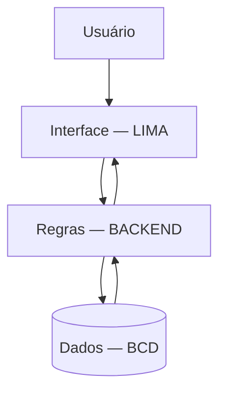

# 2º Termo — Análise e Desenvolvimento de Sistemas

### Repositório acadêmico • SENAI “Luiz Varga” • Limeira/SP

---

## Sobre este repositório

Este repositório registra as atividades, exercícios, avaliações e projetos desenvolvidos durante o **2º termo do curso de Análise e Desenvolvimento de Sistemas**. Ele funciona como um histórico prático da evolução do aprendizado, reunindo três áreas que se complementam na construção de uma aplicação:

- **BACKEND:** lógica de programação e processamento das regras do sistema;
- **BCD — Banco de Dados:** modelagem, organização, armazenamento e consulta de dados;
- **LIMA — Linguagem de Marcação:** estruturação e apresentação das interfaces web.

A proposta não é guardar somente códigos prontos. Cada pasta representa uma etapa da formação: compreender um conceito, aplicá-lo em exercícios, enfrentar desafios progressivamente mais complexos e finalmente reunir os conhecimentos em atividades somativas e projetos.

## Navegação rápida

| Área | Significado | Tecnologias e ferramentas | Conteúdo |
|---|---|---|---|
| [BACKEND](./BACKEND) | Desenvolvimento da lógica e das regras do sistema | JavaScript, Node.js e readline-sync | Entradas, cálculos, decisões, repetições, arrays, funções e erros |
| [BCD](./Banco%20De%20Dados) | **Banco de Dados** | SQL, MySQL e brModelo | Modelagem conceitual/lógica, tabelas, tipos, chaves, relacionamentos e manipulação de dados |
| [LIMA](./LIMA) | **Linguagem de Marcação** | HTML5 e CSS3 | Estrutura web, semântica, navegação, imagens, listas, estilização e layouts |
| [PROJETOS](./PROJETOS) | Integração dos conhecimentos | Tecnologias do semestre | Espaço destinado às aplicações que conectam as diferentes disciplinas |

---

# Áreas de aprendizagem

## BACKEND — Programação e regras do sistema

### O que é a matéria?

BACKEND estuda a parte de uma aplicação responsável por **receber dados, processar informações, aplicar regras de negócio e gerar resultados**. Enquanto uma interface mostra opções para o usuário, o backend decide o que deve acontecer: calcula valores, valida entradas, percorre listas, organiza operações e trata situações inesperadas.

Neste termo, a base foi construída com **JavaScript executado no Node.js**. A biblioteca `readline-sync` permite criar programas interativos no terminal, recebendo respostas do usuário e utilizando essas informações durante a execução.

### O que foi aprendido até agora?

| Etapa | Conteúdos desenvolvidos | Evidências no repositório |
|---|---|---|
| Fundamentos | Variáveis, constantes, tipos de dados, operadores, conversão com `Number()`, entrada e saída | Atividades A1 e A2 |
| Decisões | Condicionais `if`, `else`, comparação de valores e regras de aprovação, crédito e acesso | Atividades A3 e A4 |
| Repetições | Laços `for` e `while`, contadores, menus e tabuadas | Atividade A4 |
| Coleções | Arrays, índices, cadastro e processamento de conjuntos de informações | Atividade A5 |
| Modularização | Criação de funções, parâmetros, retorno e reaproveitamento de lógica | Atividades A6 e A7 |
| Problemas aplicados | Sistemas de logística, oficina e controle de consumo de energia | Atividade A7 |
| Confiabilidade | Validação de dados, lançamento de exceções e tratamento com `try...catch` | Atividade A8 |

### Evolução observada

A sequência das atividades mostra a passagem de pequenos comandos isolados para programas interativos compostos por funções, validações e regras de negócio. Os projetos de logística, oficina, energia e controle industrial aproximam os exercícios de problemas encontrados em sistemas reais.

**Estado atual:** fundamentos consolidados e avanço para organização de programas, validação e tratamento de erros.

[Explorar atividades de BACKEND →](./BACKEND)

---

## BCD — Banco de Dados

### O que é a matéria?

BCD significa **Banco de Dados**. A matéria ensina a representar informações do mundo real de maneira estruturada, permitindo que um sistema armazene, relacione, consulte e mantenha dados com segurança e consistência.

Antes de escrever SQL, é necessário entender o problema: quais entidades existem, quais atributos descrevem cada entidade e como os registros se relacionam. Por isso, o aprendizado percorre três níveis:

1. **Modelo conceitual:** representa entidades, atributos e relacionamentos sem depender de um banco específico;
2. **Modelo lógico:** transforma o conceito em tabelas, campos, chaves primárias e chaves estrangeiras;
3. **Modelo físico:** implementa a estrutura em SQL dentro de um sistema gerenciador de banco de dados.

### O que foi aprendido até agora?

| Etapa | Conteúdos desenvolvidos | Aplicações encontradas |
|---|---|---|
| Levantamento de dados | Identificação de entidades, atributos e regras do problema | Clínica médica, Smart Coffee e oficina |
| Modelagem conceitual | Diagramas entidade-relacionamento e cardinalidades | Arquivos produzidos no brModelo |
| Modelagem lógica | Tabelas, chaves primárias, chaves estrangeiras e relacionamentos 1:1, 1:N e N:N | Modelos lógicos e dicionários de dados |
| Estrutura SQL | `CREATE DATABASE`, `USE`, `CREATE TABLE` e `DROP` | Scripts da Clínica e Smart Coffee |
| Tipos e restrições | `INT`, `VARCHAR`, `TEXT`, `DATE`, `TIMESTAMP`, `DECIMAL`, `ENUM`, `NOT NULL`, `UNIQUE` e `DEFAULT` | Definição de campos e regras |
| Manutenção | `ALTER TABLE`, `RENAME TABLE`, `TRUNCATE` e remoção de colunas | Exercícios e atividade somativa |
| Manipulação | Inserção com `INSERT INTO` e consulta com `SELECT` | Registros de pacientes, médicos e atendimentos |
| Projeto avaliativo | Planejamento e criação de um banco para oficina | Pasta de atividades somativas |

### Evolução observada

O trabalho começou com a representação visual dos dados e avançou até a implementação de bancos completos. Os scripts atuais já definem diversas tabelas, tipos adequados, valores padrão, campos obrigatórios e operações de alteração, inserção e consulta.

**Estado atual:** modelagem e comandos fundamentais de SQL aplicados em cenários completos; próxima evolução natural é aprofundar chaves estrangeiras, consultas com `JOIN`, normalização, índices e transações.

[Explorar atividades de BCD →](./Banco%20De%20Dados)

---

## LIMA — Linguagem de Marcação

### O que é a matéria?

LIMA significa **Linguagem de Marcação**. A matéria desenvolve a capacidade de estruturar e apresentar conteúdo digital, especialmente páginas web. O **HTML** define o significado e a organização do conteúdo; o **CSS** determina aparência, espaçamento, cores e distribuição dos elementos.

HTML não é uma linguagem de programação: ele descreve a estrutura da página. Essa estrutura, quando construída semanticamente, melhora a leitura do código, a acessibilidade, a manutenção e a interpretação por navegadores e mecanismos de busca.

### O que foi aprendido até agora?

| Etapa | Conteúdos desenvolvidos | Evidências no repositório |
|---|---|---|
| Estrutura inicial | `DOCTYPE`, `html`, `head`, `body`, metadados e títulos | Atividade A1 |
| Conteúdo | Cabeçalhos, parágrafos, quebras de linha, links, listas e imagens | Atividades A1, A2 e A3 |
| Navegação | Links internos, externos e comunicação entre diferentes páginas | Projeto de múltiplas páginas da A2 |
| HTML semântico | `header`, `nav`, `main`, `section`, `article` e `footer` | Blog de tecnologia da A4 |
| CSS | Seletores, classes, cores, fontes, margens, preenchimento, bordas e fundos | Atividades A1 e A5 |
| Organização de estilos | CSS inline, interno e externo | Atividade A5 |
| Layout | Flexbox, alinhamento, espaçamento e composição visual | Atividades A4, A5 e A6 |
| Projeto avaliativo | Site institucional completo da DevSolutions | Somativa da A6 |

### Evolução observada

As primeiras páginas apresentam tags e estilos básicos. Em seguida aparecem navegação entre arquivos, organização semântica e separação do CSS. A atividade somativa reúne cabeçalho, menu, seções, artigos, imagens, equipe, projetos, contato e rodapé em uma página institucional completa.

**Estado atual:** páginas estruturadas e estilizadas com HTML5 e CSS3; próxima evolução natural é responsividade avançada, formulários, acessibilidade e integração com JavaScript.

[Explorar atividades de LIMA →](./LIMA)

---

# Gráfico de evolução do 2º termo

> O índice abaixo é uma representação visual da **complexidade dos conteúdos presentes no repositório**, e não uma nota escolar. A escala vai dos fundamentos (início) à aplicação integrada em desafios e avaliações (estado atual).

| Área | Fundamentos | Aplicação prática | Estado atual |
|---|---:|---:|---|
| BACKEND | ███░░░░░░░ 25% | ██████░░░░ 62% | █████████░ 91% |
| BCD | ███░░░░░░░ 30% | ███████░░░ 68% | █████████░ 88% |
| LIMA | ███░░░░░░░ 28% | ███████░░░ 66% | █████████░ 93% |

---

# Como funciona o curso de Análise e Desenvolvimento de Sistemas?

O curso forma profissionais capazes de **entender um problema, planejar uma solução digital, construir suas partes, testar o funcionamento e manter o sistema ao longo do tempo**. O desenvolvimento não acontece apenas escrevendo código: começa com a análise das necessidades e termina com uma solução utilizável, segura e documentada.

## Ciclo de desenvolvimento estudado

### 1. Análise do problema

Nesta fase são compreendidos o contexto, as necessidades do usuário e as regras que o sistema deverá respeitar. O objetivo é transformar uma ideia ampla em requisitos claros: quais dados entram, quais processos serão executados e quais resultados devem ser entregues.

### 2. Planejamento da solução

O sistema é dividido em partes menores. São planejadas as telas, os dados, os relacionamentos, as regras de negócio e a comunicação entre os componentes. Diagramas, modelos de banco, fluxos e documentação reduzem erros antes da implementação.

### 3. Desenvolvimento da interface

A interface é o ponto de contato entre usuário e sistema. Com linguagens de marcação e estilo, são criadas páginas organizadas, compreensíveis, acessíveis e adaptáveis. Neste repositório, essa competência aparece principalmente em **LIMA**.

### 4. Desenvolvimento da lógica

A lógica recebe as ações realizadas pelo usuário, valida os dados e executa as regras do sistema. Condições, repetições, arrays, funções e tratamento de exceções são ferramentas usadas para construir esse comportamento. Aqui, elas são praticadas em **BACKEND**.

### 5. Organização e persistência dos dados

Aplicações reais precisam manter informações mesmo depois de serem fechadas. A disciplina de **BCD** ensina a modelar tabelas e relacionamentos, definir restrições e utilizar SQL para criar, alterar, inserir e consultar dados.

### 6. Integração

Em uma aplicação completa, as áreas trabalham juntas:

A interface coleta uma informação; o backend valida e processa; o banco armazena ou consulta; e o resultado retorna ao usuário. Essa integração é o núcleo de sistemas como lojas virtuais, plataformas escolares, aplicativos empresariais e sistemas industriais.

### 7. Testes, documentação e evolução

O software precisa ser testado para entradas corretas e incorretas. Erros devem ser identificados e tratados, o código precisa permanecer legível e as decisões devem ser documentadas. Depois da entrega, o sistema continua evoluindo conforme surgem novos requisitos.

## Competências desenvolvidas

- Pensamento lógico e decomposição de problemas;
- Programação estruturada e organização de código;
- Modelagem e implementação de bancos de dados relacionais;
- Desenvolvimento de interfaces web;
- Validação de informações e tratamento de erros;
- Leitura de requisitos e aplicação de regras de negócio;
- Testes, documentação e controle de versões com Git e GitHub;
- Integração entre frontend, backend e banco de dados;
- Autonomia, resolução de desafios e construção de projetos.

## Papel deste repositório na formação

O repositório funciona como um **portfólio de aprendizagem**. Ao manter cada etapa versionada, é possível comparar soluções antigas e atuais, observar a evolução técnica e consultar exemplos durante novos projetos. Isso também desenvolve uma prática profissional importante: registrar o trabalho de forma organizada, rastreável e compreensível para outras pessoas.

---

## Tecnologias presentes

---

### Aprender • Praticar • Construir • Evoluir

**Desenvolvido para documentar a evolução acadêmica no 2º termo.**

